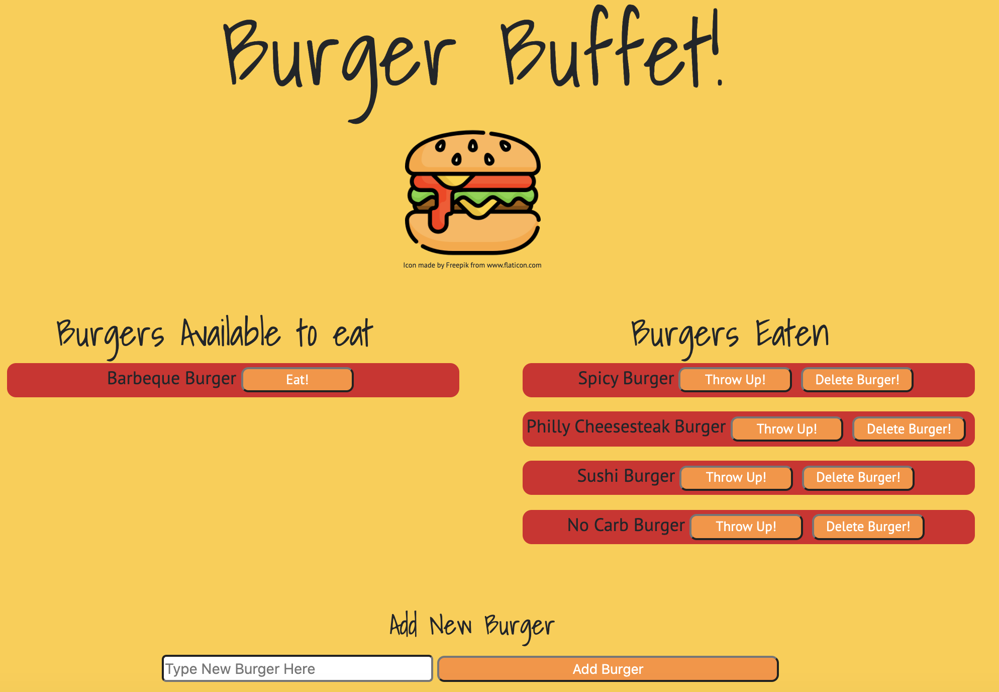

# Burger

## Description

This is a fun burger logger application. This application was created using MySQL, Node, Express, Handelbars, and a created ORM.

## Table of Contents

* [Description](#description)
* [User Story](#user-story)
* [Installation](#installation)
* [Usage](#usage)
* [License](#license)
* [Contributing](#contributing)
* [Tests](#tests)
* [Questions](#questions)
* [Deployed Application URL](#deployed-application-URL)

## User Story

As a hungry user
I want to be able to view and add burgers
So that I can eat them!

## Installation

No installation needed

## Usage

The deployed application link will take you to the homepage. The left column are burgers that are able to eat. Clicking on the eat button moves the burger to the right column. The throw up button moves the burger back to the left column. The delete burger button deletes the burger from the list. To add a burger, type in the burger name in the form and click on add burger.

## License

## Contributing

Please follow standard contributing guidelines.

## Tests

No tests to run.

## Questions

For any questions, please contact kendayao at kendayao@gmail.com

## Deployed Application URL

https://frozen-beyond-53655.herokuapp.com/

